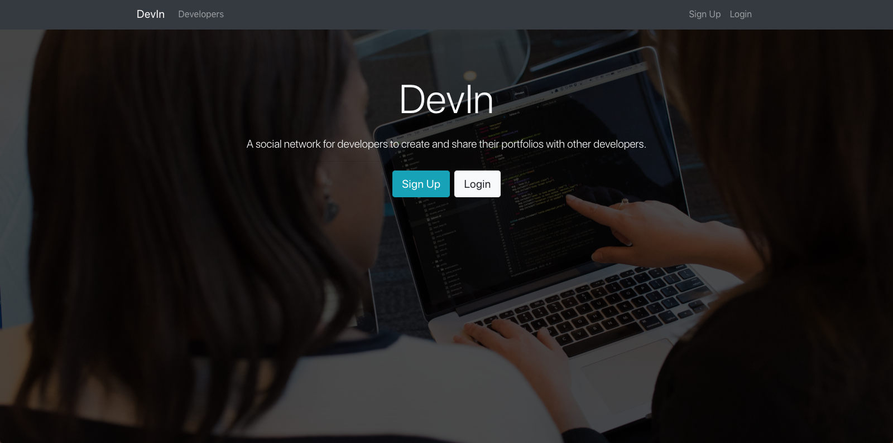

# DevIn



A Developer's Social Network built on a MERN stack.

## Setup

After installing the front end you can run the npm client-install script to install react's dependencies

```
npm run client-install
```

In addition to that, instead of running the node and react separtely, you can use concurrently to run them together by running the
dev script provided.

```
npm run dev
```
